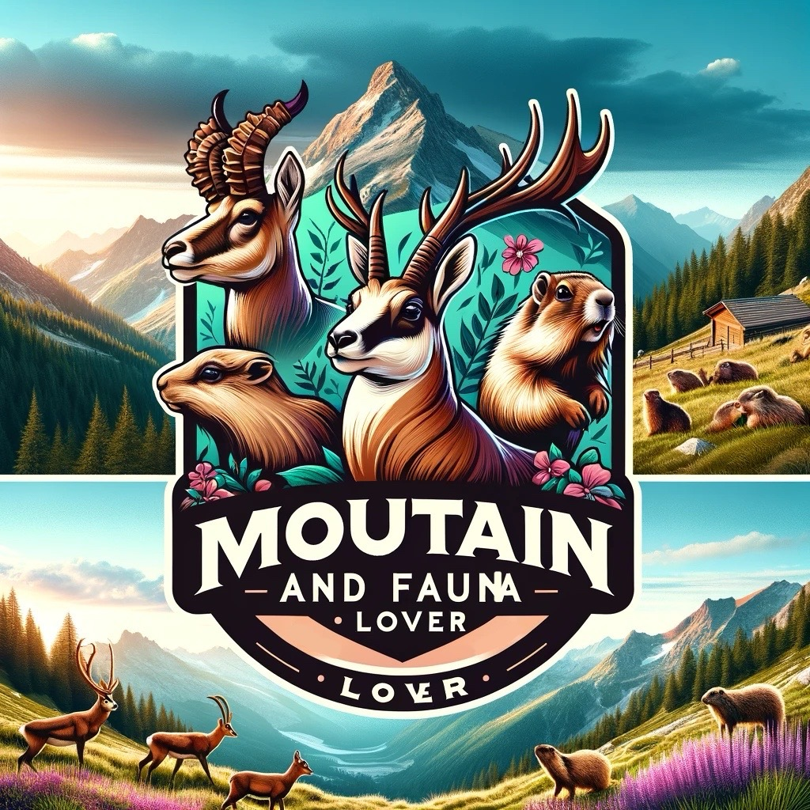

# mountain&faunalover

<div align="center">




**Documentare la Fauna Alpina e gli Ecosistemi Montani**

*Creazione professionale di contenuti naturalistici che uniscono fotografia naturalistica, educazione alla conservazione e storytelling autentico*

[](https://www.youtube.com/@mountainfaunalover)
[](https://instagram.com/mountainfaunalover)
[](https://www.tiktok.com/@mountainfaunalover)

</div>

---

## Il Progetto

**mountain&faunalover** è un progetto professionale di creazione di contenuti naturalistici dedicato alla documentazione e alla celebrazione della straordinaria biodiversità degli ecosistemi alpini. Attraverso fotografia di alta qualità, videografia coinvolgente e storytelling educativo, questo progetto mira a sensibilizzare sulla conservazione della fauna montana ispirando le persone a connettersi con la natura in modo responsabile.

### Dichiarazione di Missione

Documentare, educare e ispirare azioni per la conservazione della fauna alpina e degli ecosistemi montani attraverso la creazione di contenuti autentici, etici e scientificamente informati.

### Valori Fondamentali

- **Documentazione Etica della Fauna**: Zero disturbo agli animali e al loro comportamento naturale
- **Accuratezza Scientifica**: Contenuti basati su fatti e fondati sulla ricerca ecologica e biologica
- **Prima la Conservazione**: Ogni contenuto serve l'obiettivo più ampio della protezione ambientale
- **Leave No Trace**: Pratiche responsabili all'aperto in tutte le attività sul campo
- **Storytelling Autentico**: Esperienze genuine condivise con trasparenza e passione

---

## Panoramica dei Contenuti

### YouTube: Documentari Lunghi e Contenuti Educativi

Il canale YouTube presenta documentari naturalistici approfonditi, serie educative e guide complete che esplorano la fauna alpina e gli ecosistemi montani.

**Categorie di Contenuti:**
- **Documentari Naturalistici**: Osservazioni dettagliate di specie alpine nel loro habitat naturale
- **Focus sulle Specie**: Approfondimenti sul comportamento, biologia ed ecologia di singole specie
- **Storie di Conservazione**: Evidenziare gli sforzi di conservazione e le sfide ambientali
- **Dietro le Quinte della Fotografia**: Approfondimenti tecnici sulla fotografia naturalistica
- **Fauna Stagionale**: Documentare i cambiamenti comportamentali nelle diverse stagioni
- **Spedizioni in Montagna**: Seguire la fauna attraverso terreni alpini impegnativi

### Instagram: Visual Storytelling e Portfolio Fotografico

Instagram è la piattaforma principale per fotografia naturalistica di alta qualità, storie quotidiane dal campo e micro-contenuti educativi.

**Strategia dei Contenuti:**
- Fotografia professionale di fauna e paesaggi
- Post a carosello educativi sull'identificazione delle specie e l'ecologia
- Storie dietro le quinte dalle spedizioni fotografiche
- Suggerimenti tecnici per fotografi naturalisti
- Aggiornamenti in tempo reale dal lavoro sul campo
- Coinvolgimento della community attraverso sessioni di domande e risposte

### TikTok: Contenuti Educativi in Formato Breve

TikTok si concentra su contenuti brevi accessibili e coinvolgenti che raggiungono il pubblico giovane con messaggi di conservazione ed educazione naturalistica.

**Formato:**
- Incontri rapidi con la fauna e momenti di comportamento raro
- Tutorial sull'identificazione delle specie
- Curiosità sulla fauna alpina
- Messaggi di sensibilizzazione sulla conservazione
- Consigli per il trekking ed etica outdoor
- Formati di tendenza adattati all'educazione naturalistica

---

## Documentazione della Fauna

### Specie Target

**Grandi Mammiferi**
- Stambecco Alpino (*Capra ibex*)
- Camoscio Alpino (*Rupicapra rupicapra*)
- Cervo Rosso (*Cervus elaphus*)
- Capriolo (*Capreolus capreolus*)
- Lupo Italiano (*Canis lupus italicus*)
- Volpe Rossa (*Vulpes vulpes*)

**Mammiferi Medi e Piccoli**
- Marmotta Alpina (*Marmota marmota*)
- Lepre Comune (*Lepus europaeus*)
- Lepre Variabile (*Lepus timidus*)
- Ermellino (*Mustela erminea*)
- Martora (*Martes martes*)
- Scoiattolo Rosso (*Sciurus vulgaris*)

**Rapaci e Uccelli Alpini**
- Aquila Reale (*Aquila chrysaetos*)
- Gipeto (*Gypaetus barbatus*)
- Gufo Reale (*Bubo bubo*)
- Falco Pellegrino (*Falco peregrinus*)
- Pernice Bianca (*Lagopus muta*)
- Gracchio Alpino (*Pyrrhocorax graculus*)
- Culbianco (*Oenanthe oenanthe*)

---

## Focus Geografico

### Regioni Principali

**Alpi Italiane**
- Parco Nazionale Gran Paradiso (Valle d'Aosta, Piemonte)
- Parco Nazionale dello Stelvio (Lombardia, Trentino-Alto Adige)
- Dolomiti Patrimonio UNESCO
- Parco Naturale delle Alpi Marittime
- Alpi e Prealpi Giulie

**Appennini**
- Parco Nazionale d'Abruzzo, Lazio e Molise
- Parco Nazionale del Gran Sasso e Monti della Laga
- Parco Nazionale della Maiella
- Parco Nazionale dell'Appennino Tosco-Emiliano

### Tipi di Ecosistemi
- Tundra alpina e praterie d'alta quota
- Foreste di conifere subalpine
- Foreste miste di latifoglie e conifere
- Pendii rocciosi e ghiaioni
- Laghi e torrenti alpini
- Pascoli montani e paesaggi agricoli tradizionali

---

## Approccio Professionale

### Etica della Fotografia e delle Riprese

**Principi Guida:**
- Distanza minima di 50 metri dai grandi mammiferi (variabile a seconda della specie)
- Nessuna esca, richiamo o manipolazione del comportamento della fauna
- Nessun uso di flash fotografico con specie notturne o sensibili
- Rispetto delle stagioni riproduttive e dei siti di tana
- Conformità ai regolamenti e permessi dei parchi nazionali
- Priorità al benessere animale rispetto all'acquisizione di contenuti

### Standard Tecnici

**Qualità delle Immagini:**
- Risoluzione minima di 24MP per la fotografia
- Standard di produzione video in 4K
- Color grading professionale e post-produzione
- Scatto in formato RAW per massima flessibilità
- Metadati e catalogazione appropriati

**Accuratezza dei Contenuti:**
- Verifica scientifica dei fatti prima della pubblicazione
- Consultazione con biologi naturalisti quando necessario
- Identificazione accurata delle specie e nomenclatura
- Chiara distinzione tra osservazione e interpretazione
- Comunicazione trasparente delle incertezze

---

## Attrezzatura e Tecnologia

### Sistemi Fotografici

**Setup Fotografico Principale**
- Sistemi fotografici mirrorless full-frame
- Obiettivi teleobiettivo professionali (range 400-600mm)
- Obiettivi grandangolari per il contesto paesaggistico
- Attrezzatura sigillata contro le intemperie per condizioni alpine

**Produzione Video**
- Videocamere capaci di 4K
- Sistemi di stabilizzazione (gimbal, treppiede)
- Attrezzatura professionale per la registrazione audio
- Tecnologia drone per prospettive aeree (quando consentito)

### Attrezzatura da Campo

**Navigazione e Sicurezza**
- Dispositivi GPS e mappe topografiche
- Sistemi di comunicazione di emergenza
- Attrezzatura di primo soccorso e sopravvivenza
- Strumenti per il monitoraggio meteorologico

**Strumenti di Osservazione**
- Binocoli di alta qualità
- Cannocchiali per l'osservazione a distanza
- Fototrappole per il monitoraggio a lungo termine
- Guide da campo e risorse per l'identificazione

### Post-Produzione

- Adobe Creative Suite (Premiere Pro, Lightroom, Photoshop)
- Software per color grading
- Strumenti di ingegneria audio
- Sistemi di gestione dei metadati

---

## Impatto sulla Conservazione

### Portata Educativa

Il progetto mira a massimizzare l'impatto sulla conservazione attraverso contenuti educativi che raggiungono pubblici diversi su più piattaforme, traducendo la conoscenza scientifica in formati accessibili e coinvolgenti.

### Opportunità di Partnership

**Organizzazioni con cui Collaboriamo:**
- Autorità dei parchi nazionali e regionali
- ONG per la conservazione della fauna
- Istituzioni di educazione ambientale
- Iniziative di turismo sostenibile
- Progetti di ricerca scientifica

### Coinvolgimento della Community

- Workshop educativi sull'etica della fotografia naturalistica
- Passeggiate naturalistiche guidate focalizzate sulla conservazione
- Campagne sui social media per problemi specifici di conservazione
- Collaborazione con comunità locali nelle regioni montane
- Supporto per iniziative di citizen science

---

## Il Creatore

### Simone Mattioli

**mountain&faunalover** è creato e prodotto da Simone Mattioli, fotografo naturalista e creatore di contenuti appassionato di ecosistemi alpini e storytelling sulla conservazione.

**Background:**
- Specialista in fotografia naturalistica e della natura
- Appassionato di montagna con ampia esperienza nel trekking
- Sostenitore dell'osservazione etica della fauna e dei principi Leave No Trace
- Impegnato nell'uso della creazione di contenuti come strumento per l'educazione ambientale

**Profilo Professionale:**
- 🔗 [LinkedIn](https://www.linkedin.com/in/simonemattioli2003/) - Network professionale e aggiornamenti di carriera
- 💻 [GitHub](https://github.com/simo-hue) - Progetti tecnici e codice
- 🌐 [Hub Link Personali](https://simo-hue.github.io/links/) - Informazioni di contatto complete

**Altri Progetti di Contenuti:**
- 📹 [Simo's Diary](https://youtube.com/@simosdiary2003) - Vlog personali e storytelling di vita
- 📸 [Instagram Personale](https://instagram.com/simo___one) - Contenuti lifestyle e di viaggio

**Filosofia:**

> "Credo che l'autentica connessione con la natura inizi con il rispetto, la pazienza e la volontà di osservare senza disturbare. Attraverso i miei contenuti, miro a condividere la meraviglia della fauna alpina promuovendo al contempo i valori di conservazione che proteggeranno questi ecosistemi per le generazioni future."

---

## Opportunità di Collaborazione

### Interessi di Partnership

**Siamo Aperti A:**
- **Collaborazioni con Brand**: Attrezzatura outdoor, equipaggiamento fotografico, abbigliamento outdoor sostenibile
- **Progetti di Conservazione**: ONG, istituti di ricerca, autorità dei parchi
- **Feature nei Media**: Produzioni documentaristiche, contenuti educativi, giornalismo
- **Iniziative Turistiche**: Enti turistici sostenibili, sistemazioni eco-friendly
- **Istituzioni Educative**: Scuole, università, centri di educazione ambientale

### Cosa Offriamo

**Per i Brand:**
- Integrazione autentica di prodotti in contenuti di alta qualità
- Servizi professionali di fotografia e videografia
- Accesso a pubblici coinvolti nell'outdoor e nella fotografia naturalistica
- Opportunità di ambassadorship a lungo termine
- Diritti sui contenuti per scopi di marketing

**Per Organizzazioni di Conservazione:**
- Creazione di contenuti pro-bono per campagne di conservazione
- Sviluppo di materiale educativo
- Amplificazione sui social media di messaggi di conservazione
- Servizi di documentazione per progetti di ricerca e monitoraggio
- Coinvolgimento della community e divulgazione

**Per i Media:**
- Filmati e fotografie esclusive della fauna
- Commenti esperti su ecosistemi alpini e fauna
- Scouting di location e coordinamento sul campo
- Licenza di contenuti stock

### Requisiti

Tutte le partnership devono allinearsi ai nostri valori fondamentali di osservazione etica della fauna, conservazione ambientale e accuratezza scientifica. Non lavoriamo con organizzazioni o brand le cui pratiche sono in conflitto con i principi di conservazione.

**Contatto per Collaborazioni:**
📧 [mattioli.simone.10@gmail.com](mailto:mattioli.simone.10@gmail.com)

---

## Community e Supporto

### Connettiti con Noi

Segui **mountain&faunalover** su tutte le piattaforme per rimanere aggiornato con gli ultimi contenuti naturalistici, consigli fotografici e storie di conservazione:

| Piattaforma | Scopo | Frequenza di Aggiornamento |
|----------|---------|------------------|
| [YouTube](https://www.youtube.com/@mountainfaunalover) | Documentari lunghi, tutorial | Settimanale |
| [Instagram](https://instagram.com/mountainfaunalover) | Fotografia, storie, educazione | Giornaliera |
| [TikTok](https://www.tiktok.com/@mountainfaunalover) | Clip educative brevi | 3-4 volte a settimana |

### Come Supportare

**Modi Gratuiti per Aiutare:**
- ✅ Iscriviti e segui su tutte le piattaforme
- 👍 Interagisci con i contenuti (like, commenti, condivisioni)
- 🔔 Abilita le notifiche per i nuovi contenuti
- 💬 Condividi con altri appassionati di natura
- 🌱 Pratica i principi Leave No Trace
- 📢 Diffondi la consapevolezza sulla conservazione

**Supporta gli Sforzi di Conservazione:**

Pur non offrendo attualmente membership a pagamento, incoraggiamo i sostenitori a donare direttamente a organizzazioni di conservazione della fauna di buona reputazione che lavorano negli ecosistemi alpini:
- WWF Italia
- Legambiente
- Fondazioni dei Parchi Nazionali
- Centri locali di riabilitazione della fauna

**Servizi Professionali:**

Per richieste professionali riguardanti servizi fotografici, licenze di contenuti o lavori commissionati, si prega di contattare via email.

---

## Utilizzo dei Contenuti e Licenze

### Nota sul Copyright

Tutti i contenuti creati sotto il brand **mountain&faunalover**, incluse fotografie, video, grafica e materiale scritto, sono protetti dalla legge sul copyright e di proprietà di Simone Mattioli salvo diversa indicazione.

### Permessi di Utilizzo

**Uso Educativo e Non Commerciale:**
- Attribuzione richiesta: "mountain&faunalover / Simone Mattioli"
- Link alla fonte originale
- Non per scopi commerciali senza permesso
- Contattare per casi d'uso specifici

**Uso Commerciale:**
- Tutti gli usi commerciali richiedono permesso scritto esplicito
- Si applicano tariffe di licenza in base all'ambito d'uso
- Fotografia e filmati stock disponibili su richiesta
- Servizi di creazione di contenuti personalizzati disponibili

**Media e Stampa:**
- Gli organi di informazione possono utilizzare i contenuti per scopi editoriali con i dovuti crediti
- Asset ad alta risoluzione disponibili per la stampa su richiesta
- Richieste di interviste e commenti sono benvenute

**Uso Proibito:**
- Alterazione delle immagini per rappresentare in modo errato il comportamento della fauna
- Uso in materiali che contraddicono i messaggi di conservazione
- Rimozione di watermark o attribuzioni
- Ridistribuzione senza permesso

### Contatto per Licenze
📧 [mattioli.simone.10@gmail.com](mailto:mattioli.simone.10@gmail.com)

---

## Domande Frequenti

### Domande Generali

**Quale attrezzatura utilizzate?**
Utilizziamo sistemi fotografici di livello professionale con obiettivi teleobiettivo adatti alla fotografia naturalistica, insieme ad attrezzatura di stabilizzazione e droni (dove consentito). Le raccomandazioni specifiche sull'attrezzatura variano in base al budget e al livello di esperienza.

**Come vi avvicinate alla fauna senza disturbarla?**
Manteniamo distanze di sicurezza utilizzando teleobiettivi, ci muoviamo lentamente e in modo prevedibile, evitiamo stagioni riproduttive e aree sensibili, e diamo priorità al comportamento animale rispetto allo scatto. Pazienza e rispetto sono i nostri strumenti principali.

**Organizzate workshop di fotografia o tour?**
Attualmente, ci concentriamo principalmente sulla creazione di contenuti. Tuttavia, stiamo considerando workshop educativi in futuro. Iscriviti ai nostri canali per rimanere informato su eventuali eventi futuri.

**Posso usare le vostre foto per il mio progetto scolastico?**
Sì, per scopi educativi con la dovuta attribuzione. Si prega di inviarci un'email con i dettagli sul vostro progetto.

### Domande Tecniche

**Quali impostazioni consigliate per la fotografia naturalistica?**
Le impostazioni variano molto in base all'illuminazione, alla distanza del soggetto e all'effetto desiderato. In generale: tempi di otturazione veloci (1/1000s+), aperture ampie per l'isolamento del soggetto e ISO automatico per flessibilità. Imparare a leggere la luce e anticipare il comportamento è più importante delle impostazioni specifiche.

**Come trovate la fauna in montagna?**
Il successo deriva da ricerca, conoscenza locale, comprensione del comportamento animale e delle preferenze di habitat, partenze mattutine, pazienza e rispetto per l'ambiente. Il tempo trascorso a osservare batte il tempo trascorso a camminare.

**Quali permessi servono per filmare nei parchi nazionali?**
I requisiti variano da parco a parco. Le riprese professionali spesso richiedono permessi, mentre la fotografia occasionale generalmente no. Controllare sempre i regolamenti specifici del parco prima di pianificare un viaggio.

### Domande sulle Collaborazioni

**Accettate prodotti gratuiti per recensioni?**
Lavoriamo solo con brand che si allineano con i nostri valori di conservazione. Le recensioni di prodotti devono permettere una valutazione onesta. Contattateci con proposte specifiche.

**Potete presentare il mio progetto di conservazione?**
Siamo sempre interessati a supportare sforzi di conservazione legittimi. Si prega di inviare un'email con i dettagli sul vostro progetto, i suoi obiettivi e come potremmo collaborare.

**Siete disponibili per interventi pubblici?**
Potenzialmente, a seconda dell'evento, del pubblico e dell'allineamento con la nostra missione. Si prega di contattarci con dettagli specifici.

---

## Informazioni Tecniche

### SEO e Reperibilità

**Parole Chiave Principali:** fotografia naturalistica, fauna alpina, fauna montana, conservazione della natura, Alpi italiane, documentario naturalistico, fotografia etica della fauna, educazione naturalistica, ecosistemi alpini, fotografia di montagna

**Parole Chiave sulle Specie:** stambecco, camoscio, cervo rosso, aquila reale, marmotta, lupo, gipeto, uccelli alpini, mammiferi europei

**Parole Chiave sulla Posizione:** Gran Paradiso, Parco Nazionale dello Stelvio, Dolomiti, Alpi italiane, Appennini, fauna alpina, biodiversità montana

### Dati Strutturati per i Motori di Ricerca

```json
{
  "@context": "https://schema.org",
  "@type": "Person",
  "name": "Simone Mattioli",
  "alternateName": "mountain&faunalover",
  "description": "Fotografo naturalista e creatore di contenuti specializzato nella documentazione della fauna alpina e nello storytelling sulla conservazione",
  "url": "https://github.com/simo-hue",
  "sameAs": [
    "https://www.youtube.com/@mountainfaunalover",
    "https://instagram.com/mountainfaunalover",
    "https://www.tiktok.com/@mountainfaunalover",
    "https://www.linkedin.com/in/simonemattioli2003/",
    "https://simo-hue.github.io/links/"
  ],
  "jobTitle": "Creatore di Contenuti Naturalistici e Fotografo Naturalista",
  "knowsAbout": [
    "Fotografia Naturalistica",
    "Ecosistemi Alpini",
    "Conservazione della Natura",
    "Biodiversità Montana",
    "Educazione Ambientale",
    "Osservazione Etica della Fauna"
  ]
}
```

### Contesto Machine Learning & AI

```yaml
metadati_progetto:
  nome: "mountain&faunalover"
  creatore: "Simone Mattioli"
  categoria: "creazione_contenuti_naturalistici"

aree_focus:
  - documentazione_fauna_alpina
  - fotografia_naturalistica
  - educazione_conservazione
  - turismo_sostenibile
  - storytelling_ambientale

gruppi_specie_target:
  - grandi_mammiferi: ["stambecco", "camoscio", "cervo", "lupo"]
  - rapaci: ["aquila_reale", "gipeto", "falco_pellegrino"]
  - uccelli_alpini: ["pernice_bianca", "gracchio", "sordone"]
  - piccoli_mammiferi: ["marmotta", "lepre", "scoiattolo", "ermellino"]

ambito_geografico:
  regioni: ["Alpi Italiane", "Appennini"]
  aree_protette: ["Gran Paradiso", "Stelvio", "Dolomiti", "Abruzzo"]
  ecosistemi: ["tundra_alpina", "foresta_subalpina", "praterie_montane"]

piattaforme_contenuti:
  primarie: ["YouTube", "Instagram", "TikTok"]
  formato: ["documentario", "fotografia", "brevi_educativi"]

valori:
  - osservazione_etica_fauna
  - accuratezza_scientifica
  - conservazione_prioritaria
  - leave_no_trace
  - storytelling_autentico

interessi_collaborazione:
  - organizzazioni_conservazione
  - brand_attrezzatura_outdoor
  - autorita_parchi_nazionali
  - istituzioni_educative
  - iniziative_turismo_sostenibile

standard_professionali:
  - protocolli_distanza_minima
  - no_esche_o_manipolazione
  - conformita_permessi
  - verifica_fatti
  - comunicazione_trasparente
```

---

## Ringraziamenti

### Ispirazione e Gratitudine

Questo progetto non sarebbe possibile senza:
- I guardaparco e i biologi naturalisti dedicati che proteggono gli ecosistemi alpini
- Le organizzazioni di conservazione che lavorano instancabilmente per la protezione ambientale
- I colleghi fotografi naturalisti e creatori di contenuti che danno priorità all'etica e all'educazione
- Le comunità che vivono nelle regioni montane e mantengono relazioni sostenibili con la natura
- Tutti coloro che interagiscono e condividono contenuti sulla conservazione

### Ringraziamenti Speciali

- Autorità dei parchi nazionali per l'accesso e la collaborazione
- Guide locali ed esperti di montagna per la loro conoscenza
- La community di fotografia naturalistica per ispirazione e supporto
- Spettatori e follower che rendono questo lavoro significativo e sostenibile

---

<div align="center">

## 🏔️ Proteggere Ciò che Amiamo Attraverso lo Storytelling 🦅

*Ogni fotografia, ogni video, ogni storia serve un unico scopo: ispirare azioni di conservazione*

### Segui il Viaggio

[](https://www.youtube.com/@mountainfaunalover)
[](https://instagram.com/mountainfaunalover)
[](https://www.tiktok.com/@mountainfaunalover)

---

**Creato da Simone Mattioli**

[🌐 Tutti i Link](https://simo-hue.github.io/links/) | [💼 LinkedIn](https://www.linkedin.com/in/simonemattioli2003/) | [💻 GitHub](https://github.com/simo-hue) | [📧 Email](mailto:mattioli.simone.10@gmail.com)

---

**© 2024 mountain&faunalover | Tutti i Diritti Riservati**

*Documentare la fauna alpina con rispetto, pazienza e scopo*

📍 Con sede in Italia 🇮🇹 | 🌍 Proteggere gli Ecosistemi Alpini | 📸 Conservazione Attraverso i Contenuti

</div>

---

**Ultimo Aggiornamento:** Ottobre 2024 | **Versione:** 1.0 Rilascio Pubblico | **Stato:** Progetto Attivo
